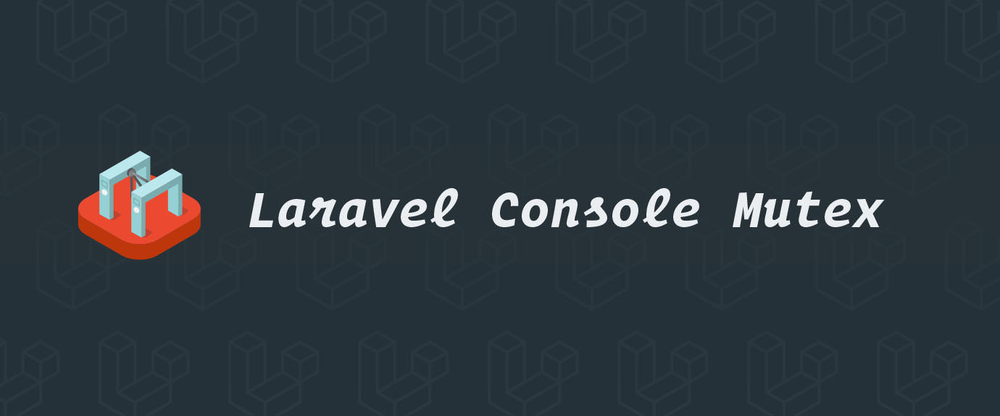

# Laravel Console Mutex

[](https://patreon.com/dmitryivanov)

[](https://github.styleci.io/repos/59570052?branch=master)
[](https://github.com/dmitry-ivanov/laravel-console-mutex/actions?query=workflow%3Atests+branch%3Amaster)
[](https://app.codecov.io/gh/dmitry-ivanov/laravel-console-mutex/branch/master)


Mutex for Laravel Console Commands.

| Laravel | Console Mutex                                                            |
|---------|--------------------------------------------------------------------------|
| 9.x     | [9.x](https://github.com/dmitry-ivanov/laravel-console-mutex/tree/9.x)   |
| 8.x     | [8.x](https://github.com/dmitry-ivanov/laravel-console-mutex/tree/8.x)   |
| 7.x     | [7.x](https://github.com/dmitry-ivanov/laravel-console-mutex/tree/7.x)   |
| 6.x     | [6.x](https://github.com/dmitry-ivanov/laravel-console-mutex/tree/6.x)   |
| 5.8.*   | [5.8.*](https://github.com/dmitry-ivanov/laravel-console-mutex/tree/5.8) |
| 5.7.*   | [5.7.*](https://github.com/dmitry-ivanov/laravel-console-mutex/tree/5.7) |
| 5.6.*   | [5.6.*](https://github.com/dmitry-ivanov/laravel-console-mutex/tree/5.6) |
| 5.5.*   | [5.5.*](https://github.com/dmitry-ivanov/laravel-console-mutex/tree/5.5) |
| 5.4.*   | [5.4.*](https://github.com/dmitry-ivanov/laravel-console-mutex/tree/5.4) |
| 5.3.*   | [5.3.*](https://github.com/dmitry-ivanov/laravel-console-mutex/tree/5.3) |
| 5.2.*   | [5.2.*](https://github.com/dmitry-ivanov/laravel-console-mutex/tree/5.2) |
| 5.1.*   | [5.1.*](https://github.com/dmitry-ivanov/laravel-console-mutex/tree/5.1) |


## Table of contents

- [Usage](#usage)
- [Strategies](#strategies)
- [Advanced](#advanced)
  - [Set custom timeout](#set-custom-timeout)
  - [Handle multiple commands](#handle-multiple-commands)
  - [Set custom storage folder](#set-custom-storage-folder)
- [Troubleshooting](#troubleshooting)
  - [Trait included, but nothing happens?](#trait-included-but-nothing-happens)
  - [Several traits conflict?](#several-traits-conflict)
- [Sponsors](#sponsors)
- [License](#license)

## Usage

1. Install the package via Composer:

    ```shell script
    composer require illuminated/console-mutex
    ```

2. Use `Illuminated\Console\WithoutOverlapping` trait:

    ```php
    use Illuminated\Console\WithoutOverlapping;

    class ExampleCommand extends Command
    {
        use WithoutOverlapping;

        // ...
    }
    ```

## Strategies

Mutex can prevent overlapping by using various strategies:

- `file` (default)
- `mysql`
- `redis`
- `memcached`

The default `file` strategy is acceptable for small applications, which are deployed on a single server.
If your application is more complex and deployed on several nodes, you should consider using another mutex strategy.

You can change strategy by using the `$mutexStrategy` field:

```php
class ExampleCommand extends Command
{
    use WithoutOverlapping;

    protected string $mutexStrategy = 'mysql';

    // ...
}
```

Or by using the `setMutexStrategy()` method:

```php
class ExampleCommand extends Command
{
    use WithoutOverlapping;

    public function __construct()
    {
        parent::__construct();

        $this->setMutexStrategy('mysql');
    }

    // ...
}
```

## Advanced

### Set custom timeout

By default, if mutex sees that the command is already running, it will immediately quit.
You can change that behavior by setting a timeout in which mutex can wait for another running command to finish its execution.

You can set the timeout by specifying the `$mutexTimeout` field:

```php
class ExampleCommand extends Command
{
    use WithoutOverlapping;

    // In milliseconds
    protected ?int $mutexTimeout = 3000;

    // ...
}
```

Or by using the `setMutexTimeout()` method:

```php
class ExampleCommand extends Command
{
    use WithoutOverlapping;

    public function __construct()
    {
        parent::__construct();

        // In milliseconds
        $this->setMutexTimeout(3000);
    }

    // ...
}
```

Here's how the `$mutexTimeout` field is treated:

- `0` - no waiting (default);
- `{int}` - wait for the given number of milliseconds;
- `null` - wait for the running command to finish its execution;

### Handle multiple commands

Sometimes it might be useful to have a shared mutex for multiple commands.
You can easily achieve that by setting the same mutex name for all of those commands.

You should use the `getMutexName()` method for that:

```php
class ExampleCommand extends Command
{
    use WithoutOverlapping;

    public function getMutexName()
    {
        return 'shared-for-command1-and-command2';
    }

    // ...
}
```

### Set custom storage folder

If you're using the `file` strategy, mutex files would be stored in the `storage/app` folder.

You can change that by overriding the `getMutexFileStorage()` method:

```php
class ExampleCommand extends Command
{
    use WithoutOverlapping;

    public function getMutexFileStorage()
    {
        return storage_path('my/custom/path');
    }

    // ...
}
```

## Troubleshooting

### Trait included, but nothing happens?

`WithoutOverlapping` trait overrides the `initialize()` method:

```php
trait WithoutOverlapping
{
    protected function initialize(InputInterface $input, OutputInterface $output)
    {
        $this->initializeMutex();

        parent::initialize($input, $output);
    }

    // ...
}
```

If your command overrides the `initialize()` method too, you have to call the `initializeMutex()` method by yourself:

```php
class ExampleCommand extends Command
{
    use WithoutOverlapping;

    protected function initialize(InputInterface $input, OutputInterface $output)
    {
        // You have to call it first
        $this->initializeMutex();

        // Then goes your custom code
        $this->foo = $this->argument('foo');
        $this->bar = $this->argument('bar');
        $this->baz = $this->argument('baz');
    }

    // ...
}
```

### Several traits conflict?

If you're using another `illuminated/console-%` package, you'll get the "traits conflict" error.

For example, if you're building a [loggable command](https://github.com/dmitry-ivanov/laravel-console-logger), which doesn't allow overlapping:

```php
class ExampleCommand extends Command
{
    use Loggable;
    use WithoutOverlapping;

    // ...
}
```

You'll get the traits conflict, because both of those traits are overriding the `initialize()` method:
> If two traits insert a method with the same name, a fatal error is produced, if the conflict is not explicitly resolved.

To fix that - override the `initialize()` method and resolve the conflict:

```php
class ExampleCommand extends Command
{
    use Loggable;
    use WithoutOverlapping;

    protected function initialize(InputInterface $input, OutputInterface $output)
    {
        // Initialize conflicting traits
        $this->initializeMutex();
        $this->initializeLogging();
    }

    // ...
}
```

## Sponsors

[](https://laravel-idea.com)

## License

Laravel Console Mutex is open-sourced software licensed under the [MIT license](LICENSE.md).

[](https://patreon.com/dmitryivanov)
